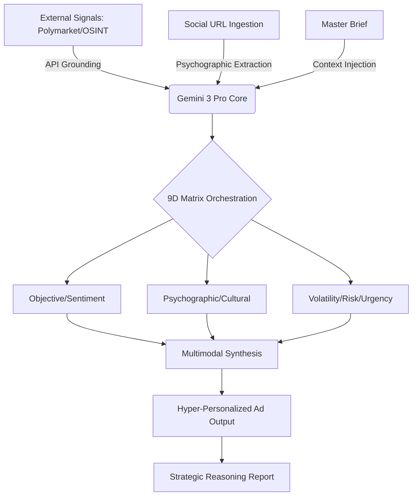

# AdArchitect: High-Dimensional Autonomous Synthesis under Multi-Market Uncertainty

**Authors:** Juan Esteban Gómez, Isaac Mendoza (**Consultora Talleyrand**)  
**AI Lead Agent:** Gemini-3-Pro Cognitive Core  
**Version:** 2.5 (Talleyrand Edition)  
**Category:** Computational Intelligence > Persuasive Systems

---

### Abstract
Developed by **Talleyrand**, **AdArchitect** is an autonomous framework designed for the high-fidelity synthesis of advertising assets in high-volatility environments. The system utilizes a **9-dimensional targeting matrix ($\mathbb{R}^9$)** to map real-time signals from **Polymarket** and **OSINT** feeds into hyper-personalized creative deployments. This version introduces an optimized neural pipeline that maximizes cognitive reasoning (via `thinkingBudget`) to resolve socio-cultural contradictions before content emission.

### 1. System Architecture & Data Flow

### 2. Methodology: The 9-Dimensional Latent Space
The core innovation lies in the transformation of a 4-vector model into a dense 9D matrix:
- **$\mathbf{V}_{vol}$ (Volatility Index)**: Measures the rate of change in prediction markets.
- **$\mathbf{P}_{psy}$ (Psychographic Archetype)**: Maps the user into cognitive clusters (e.g., *Analytical* vs. *Impulsive*).
- **$\mathbf{C}_{cul}$ (Cultural Nuance)**: Adjusts linguistic filters for hyper-local or globalist contexts.

### 3. Implementation Details
The framework is built on a React/TypeScript stack, leveraging the `@google/genai` SDK. It employs a "Deep Reasoning" phase where the model simulates potential audience reactions to various psychographic triggers before finalizing the copy.

---
© 2025 Consultora Talleyrand. All rights reserved.
*Keywords: High-Dimensional Inference, OSINT Intelligence, Persuasive Technology, Gemini 3 Pro.*
