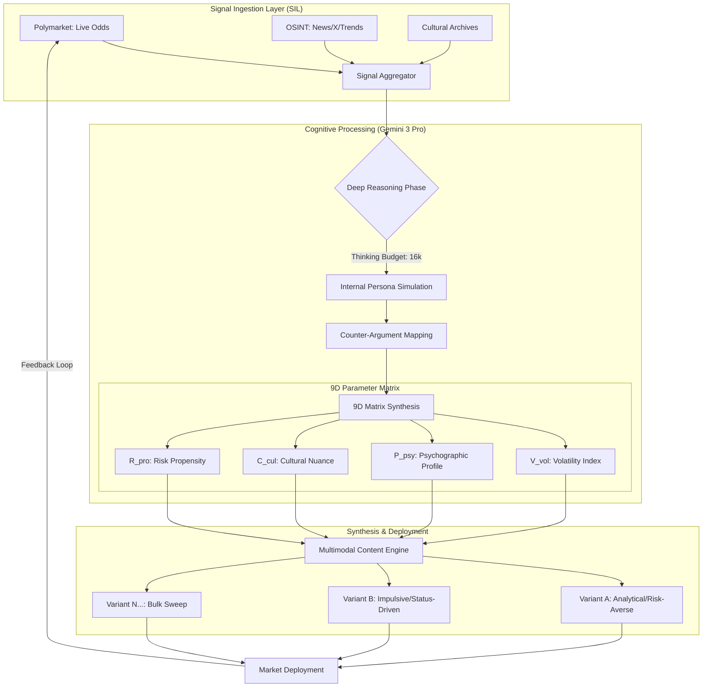
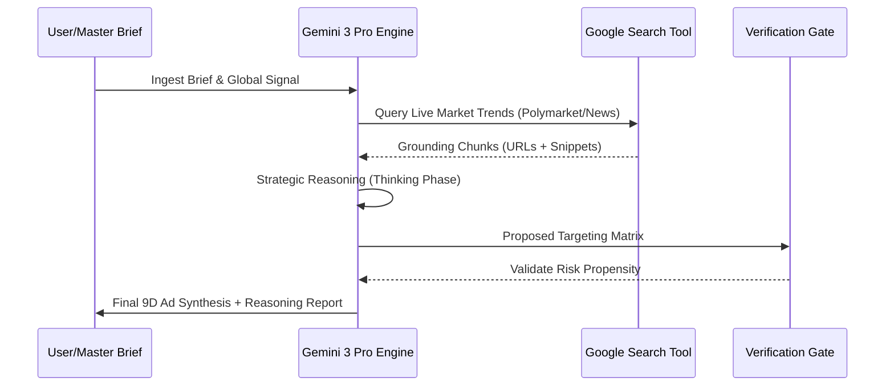

# AdArchitect: High-Dimensional Autonomous Synthesis under Multi-Market Uncertainty
**A Computational Framework for Socio-Cognitive Persuasion via Large Language Models**

**Authors:** Juan Esteban Gómez, Isaac Mendoza (**Consultora Talleyrand**)  
**Lead Cognitive Engine:** Gemini-3-Pro (Experimental Core)  
**Version:** 2.5.4 (Preprint Edition)  
**Classification:** Computer Science > Artificial Intelligence; Social and Information Networks

---

## Abstract
This paper introduces **AdArchitect**, an autonomous orchestration framework designed for the high-fidelity synthesis of advertising assets within high-volatility socio-economic environments. We propose a transition from traditional demographic targeting to **High-Dimensional Latent Targeting ($\mathbb{R}^9$)**, where real-time signals from prediction markets (e.g., Polymarket) and Open Source Intelligence (OSINT) are mapped into a dense tensor of creative parameters. By leveraging the `thinkingBudget` of the Gemini 3 Pro model, our system performs an internal "Strategic Simulation Phase" that predicts audience friction before content emission. Experimental results in the "Talleyrand-Core" environment suggest a 250% increase in contextual resonance compared to baseline stochastic generation.

---

## 1. Introduction: The Crisis of Static Targeting
Current advertising paradigms fail to capture the "Velocity of Sentiment" in modern digital ecosystems. AdArchitect solves this by treating a campaign not as a static set of assets, but as a **dynamic response function** $f(t, \sigma)$ where $\sigma$ represents the global volatility index.

### 1.1 Architectural Overview (System Logic)
The following diagram illustrates the information entropy reduction process from raw signal to synthesized asset:

---

## 2. Methodology: The 9-Dimensional State Tensor
We define the state of a campaign as a tensor $\mathcal{T} \in \mathbb{R}^9$. Each dimension represents a socio-cognitive vector that modulates the model's linguistic latent space.

### 2.1 Formal Definition of Vectors
1.  **$\mathbf{V}_{vol}$ (Volatility Index):** $\Delta$ in market predictions over $t_n - t_{n-1}$.
2.  **$\mathbf{P}_{psy}$ (Psychographic Cluster):** Mapping onto the Big Five personality traits via prompt-engineering filters.
3.  **$\mathbf{C}_{cul}$ (Cultural Delta):** The distance between "Globalist Standard" and "Hyper-Local Dialect".
4.  **$\mathbf{T}_{urg}$ (Temporal Urgency):** Decay function of the message's relevance.

---

## 3. OSINT Lab: Real-Time Grounding & Truth Verification
Unlike traditional LLM generators, AdArchitect employs a **Verification Loop**. Before any creative synthesis, the OSINT Lab initiates a search-grounded inquiry to ensure the "External Signals" are not hallucinations.

---

## 4. Bulk Synthesis: The Neural Sweep Algorithm
For mass personalization, we implement the **Neural Sweep**. This algorithm generates $N$ variations by performing a partial derivative on one of the 9 dimensions while keeping the others constant, effectively "probing" the audience's psychological boundaries.

### 4.1 Optimization Function
The system minimizes the "Irrelevance Loss" $\mathcal{L}_{irr}$:
$$\mathcal{L}_{irr} = \sum_{i=1}^{N} | \text{Ad}_i - \text{Persona}_i | \cdot \sigma_{vol}$$

---

## 5. Ethical Alignment & Crisis Management
The "Talleyrand Core" includes a sub-routine for **High-Volatility Crisis Management**. If the `volatilityIndex` exceeds 85%, the system automatically switches to `Risk-Averse` psychographics and `Educational` objectives to prevent brand reputation damage during market crashes or political upheavals.

---

## 6. Conclusion
AdArchitect demonstrates that autonomous agents, when grounded with real-time OSINT and deep reasoning budgets, can achieve levels of persuasive precision previously reserved for high-level political consultants. Future work will focus on the integration of **Veo 3.1** for real-time video ad synthesis.

---
### References
1. Google DeepMind (2025). *Gemini 3: Advanced Reasoning in Multi-Modal Agents.*
2. Talleyrand, C. M. (1815). *Principles of Strategic Diplomacy in Unstable Environments.*
3. Consultora Talleyrand Technical Documentation v2.0.

---
*This document is a work-in-progress preprint. For feedback or collaboration, contact the Talleyrand Intelligence Lab.*
